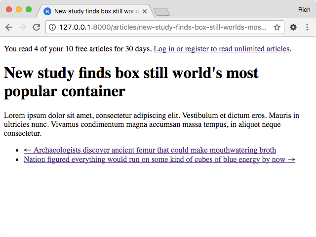

.. _index:
.. module:: regwall

Django Registration Wall
************************

|PyPI version|_ |Build status|_

.. |PyPI version| image::
   https://badge.fury.io/py/django-registrationwall.svg
.. _PyPI version: https://pypi.python.org/pypi/django-registrationwall

.. |Build status| image::
   https://travis-ci.org/richardcornish/django-registrationwall.svg?branch=master
.. _Build status: https://travis-ci.org/richardcornish/django-registrationwall

**Django Registration Wall** is a `Django <https://www.djangoproject.com/>`_ `mixin <https://docs.djangoproject.com/en/1.11/topics/class-based-views/mixins/>`_ `application <https://docs.djangoproject.com/en/1.11/intro/reusable-apps/>`_ that limits an `anonymous user <https://docs.djangoproject.com/en/1.11/ref/contrib/auth/#anonymoususer-object>`_'s access to content, after which the user is redirected to the `login URL <https://docs.djangoproject.com/en/1.11/ref/settings/#std:setting-LOGIN_URL>`_. The behavior is modeled after the common `paywall <https://en.wikipedia.org/wiki/Paywall>`_ scenario.

Fake news articles credit goes to The Onion.

* `Package distribution <https://pypi.python.org/pypi/django-registrationwall>`_
* `Code repository <https://github.com/richardcornish/django-registrationwall>`_
* `Documentation <https://django-registrationwall.readthedocs.io/>`_
* `Tests <https://travis-ci.org/richardcornish/django-registrationwall>`_

Install
=======

.. code-block:: bash

   $ pip install django-registrationwall

Add to ``settings.py``.

.. code-block:: python

   INSTALLED_APPS = [
       # ...
       'regwall',
   ]

Add to one of your ``views.py``.

.. code-block:: python

   from django.views.generic import DetailView

   from regwall.mixins import RaiseRegWallMixin

   from .models import Article

   class ArticleDetailView(RaiseRegWallMixin, DetailView):
       model = Article

Contents
========

.. toctree::
   :maxdepth: 2

   install
   usage
   settings
   documentation
   tests

Indices and tables
==================

* :ref:`genindex`
* :ref:`modindex`
* :ref:`search`
